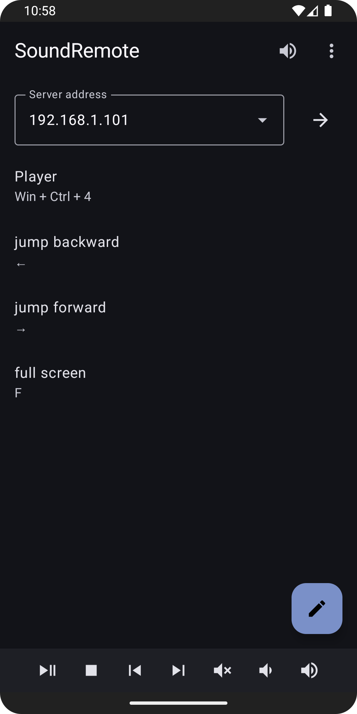
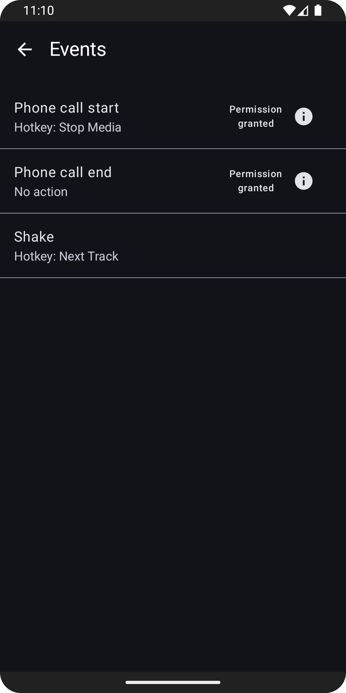

# SoundRemote android client

An Android app that, when paired up with [SoundRemote server](https://github.com/ashipo/SoundRemote-server), allows to:

- Capture and stream audio from a PC to an Android device
- Execute keyboard commands on the PC remotely from the Android app either directly through its UI or by binding to certain events such as device shaking or incoming phone call
- Control media on the PC through the Android media notification

## Screenshots

⠀
⠀

